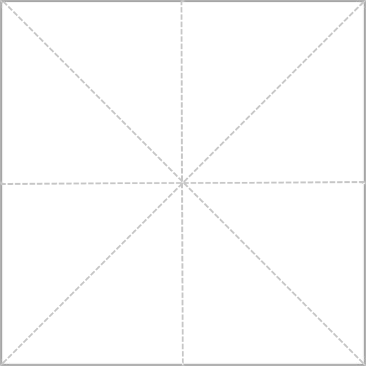
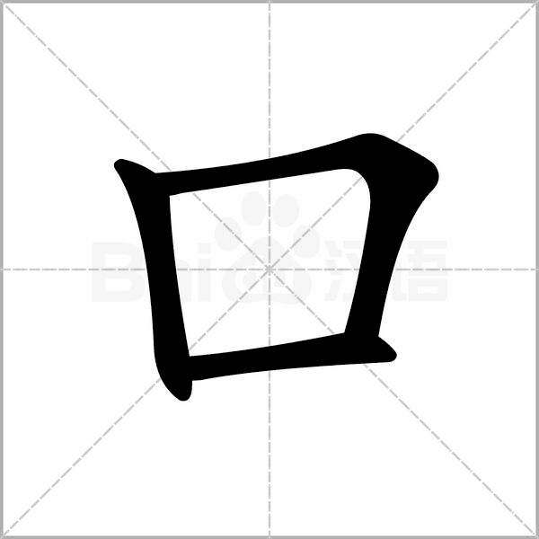
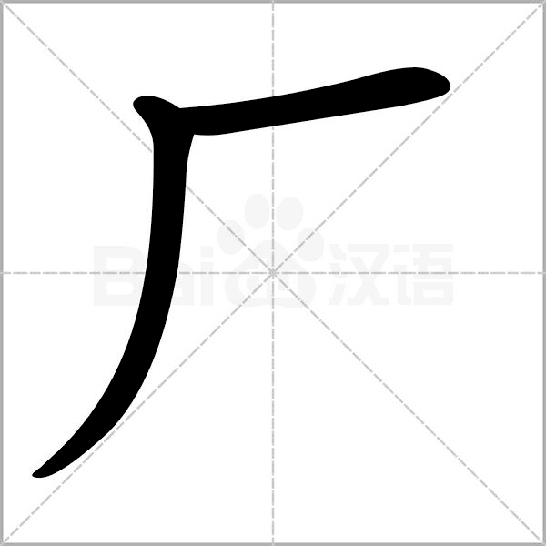

# hanzi

<table style="font-size:20px">
        <tr >
            <td>
                <label>拼音:</label> <b>yī</b> 
                <label>部首:</label> 一  
                <label>笔画:</label> 1
            </td>
        </tr>
        <tr>
            <td>
                
                
                
                
                
                
                
                
                
                
                
            </td>
        </tr>

        <tr >
            <td>
                <label>拼音:</label> <b>èr</b> 
                <label>部首:</label> 二  
                <label>笔画:</label> 2
            </td>
        </tr>
        <tr>
            <td>
                
                
                
                
                
                
                
                
                
                
                
            </td>
        </tr>

        <tr >
            <td>
                <label>拼音:</label> <b>sān</b> 
                <label>部首:</label> 一  
                <label>笔画:</label> 3
            </td>
        </tr>
        <tr>
            <td>
                
                
                
                
                
                
                
                
                
                
                
            </td>
        </tr>

        <tr >
            <td>
                <label>拼音:</label> <b>shǎng</b> 
                <label>部首:</label> 一  
                <label>笔画:</label> 3
            </td>
        </tr>
        <tr>
            <td>
                
                
                
                
                
                
                
                
                
                
                
            </td>
        </tr>

        <tr >
            <td>
                <label>拼音:</label> <b>kǒu</b> 
                <label>部首:</label> 口  
                <label>笔画:</label> 3
            </td>
        </tr>
        <tr>
            <td>
                
                
                
                
                
                
                
                
                
                
                
            </td>
        </tr>

        <tr >
            <td>
                <label>拼音:</label> <b>mù</b> 
                <label>部首:</label> 目  
                <label>笔画:</label> 5
            </td>
        </tr>
        <tr>
            <td>
                
                
                
                
                
                
                
                
                
                
                
            </td>
        </tr>

        <tr >
            <td>
                <label>拼音:</label> <b>ěr</b> 
                <label>部首:</label> 耳  
                <label>笔画:</label> 6
            </td>
        </tr>
        <tr>
            <td>
                
                
                
                
                
                
                
                
                
                
                
            </td>
        </tr>

        <tr >
            <td>
                <label>拼音:</label> <b>shǒu</b> 
                <label>部首:</label> 手  
                <label>笔画:</label> 4
            </td>
        </tr>
        <tr>
            <td>
                
                
                
                
                
                
                
                
                
                
                
            </td>
        </tr>

        <tr >
            <td>
                <label>拼音:</label> <b>rì</b> 
                <label>部首:</label> 日  
                <label>笔画:</label> 4
            </td>
        </tr>
        <tr>
            <td>
                
                
                
                
                
                
                
                
                
                
                
            </td>
        </tr>

        <tr >
            <td>
                <label>拼音:</label> <b>tián</b> 
                <label>部首:</label> 田  
                <label>笔画:</label> 5
            </td>
        </tr>
        <tr>
            <td>
                
                
                
                
                
                
                
                
                
                
                
            </td>
        </tr>

        <tr >
            <td>
                <label>拼音:</label> <b>hé</b> 
                <label>部首:</label> 禾  
                <label>笔画:</label> 5
            </td>
        </tr>
        <tr>
            <td>
                
                
                
                
                
                
                
                
                
                
                
            </td>
        </tr>

        <tr >
            <td>
                <label>拼音:</label> <b>chóng</b> 
                <label>部首:</label> 虫  
                <label>笔画:</label> 6
            </td>
        </tr>
        <tr>
            <td>
                
                
                
                
                
                
                
                
                
                
                
            </td>
        </tr>

        <tr >
            <td>
                <label>拼音:</label> <b>yún</b> 
                <label>部首:</label> 二  
                <label>笔画:</label> 4
            </td>
        </tr>
        <tr>
            <td>
                
                
                
                
                
                
                
                
                
                
                
            </td>
        </tr>

        <tr >
            <td>
                <label>拼音:</label> <b>shān</b> 
                <label>部首:</label> 山  
                <label>笔画:</label> 3
            </td>
        </tr>
        <tr>
            <td>
                
                
                
                
                
                
                
                
                
                
                
            </td>
        </tr>

        <tr >
            <td>
                <label>拼音:</label> <b>bā</b> 
                <label>部首:</label> 八  
                <label>笔画:</label> 2
            </td>
        </tr>
        <tr>
            <td>
                
                
                
                
                
                
                
                
                
                
                
            </td>
        </tr>

        <tr >
            <td>
                <label>拼音:</label> <b>shí</b> 
                <label>部首:</label> 十  
                <label>笔画:</label> 2
            </td>
        </tr>
        <tr>
            <td>
                
                
                
                
                
                
                
                
                
                
                
            </td>
        </tr>

        <tr >
            <td>
                <label>拼音:</label> <b>le</b> 
                <label>部首:</label> 乛  
                <label>笔画:</label> 2
            </td>
        </tr>
        <tr>
            <td>
                
                
                
                
                
                
                
                
                
                
                
            </td>
        </tr>

        <tr >
            <td>
                <label>拼音:</label> <b>zǐ</b> 
                <label>部首:</label> 子  
                <label>笔画:</label> 3
            </td>
        </tr>
        <tr>
            <td>
                
                
                
                
                
                
                
                
                
                
                
            </td>
        </tr>

        <tr >
            <td>
                <label>拼音:</label> <b>rén</b> 
                <label>部首:</label> 人  
                <label>笔画:</label> 2
            </td>
        </tr>
        <tr>
            <td>
                
                
                
                
                
                
                
                
                
                
                
            </td>
        </tr>

        <tr >
            <td>
                <label>拼音:</label> <b>dà</b> 
                <label>部首:</label> 大  
                <label>笔画:</label> 3
            </td>
        </tr>
        <tr>
            <td>
                
                
                
                
                
                
                
                
                
                
                
            </td>
        </tr>

        <tr >
            <td>
                <label>拼音:</label> <b>yuè</b> 
                <label>部首:</label> 月  
                <label>笔画:</label> 4
            </td>
        </tr>
        <tr>
            <td>
                
                
                
                
                
                
                
                
                
                
                
            </td>
        </tr>

        <tr >
            <td>
                <label>拼音:</label> <b>ér</b> 
                <label>部首:</label> 儿  
                <label>笔画:</label> 2
            </td>
        </tr>
        <tr>
            <td>
                
                
                
                
                
                
                
                
                
                
                
            </td>
        </tr>

        <tr >
            <td>
                <label>拼音:</label> <b>tóu</b> 
                <label>部首:</label> 大  
                <label>笔画:</label> 5
            </td>
        </tr>
        <tr>
            <td>
                
                
                
                
                
                
                
                
                
                
                
            </td>
        </tr>

        <tr >
            <td>
                <label>拼音:</label> <b>lǐ</b> 
                <label>部首:</label> 里  
                <label>笔画:</label> 7
            </td>
        </tr>
        <tr>
            <td>
                
                
                
                
                
                
                
                
                
                
                
            </td>
        </tr>

        <tr >
            <td>
                <label>拼音:</label> <b>kě</b> 
                <label>部首:</label> 口  
                <label>笔画:</label> 5
            </td>
        </tr>
        <tr>
            <td>
                
                
                
                
                
                
                
                
                
                
                
            </td>
        </tr>

        <tr >
            <td>
                <label>拼音:</label> <b>dōng</b> 
                <label>部首:</label> 一  
                <label>笔画:</label> 5
            </td>
        </tr>
        <tr>
            <td>
                
                
                
                
                
                
                
                
                
                
                
            </td>
        </tr>

        <tr >
            <td>
                <label>拼音:</label> <b>xī</b> 
                <label>部首:</label> 覀  
                <label>笔画:</label> 6
            </td>
        </tr>
        <tr>
            <td>
                
                
                
                
                
                
                
                
                
                
                
            </td>
        </tr>

        <tr >
            <td>
                <label>拼音:</label> <b>tiān</b> 
                <label>部首:</label> 大  
                <label>笔画:</label> 4
            </td>
        </tr>
        <tr>
            <td>
                
                
                
                
                
                
                
                
                
                
                
            </td>
        </tr>

        <tr >
            <td>
                <label>拼音:</label> <b>sì</b> 
                <label>部首:</label> 囗  
                <label>笔画:</label> 5
            </td>
        </tr>
        <tr>
            <td>
                
                
                
                
                
                
                
                
                
                
                
            </td>
        </tr>

        <tr >
            <td>
                <label>拼音:</label> <b>shì</b> 
                <label>部首:</label> 日  
                <label>笔画:</label> 9
            </td>
        </tr>
        <tr>
            <td>
                
                
                
                
                
                
                
                
                
                
                
            </td>
        </tr>

        <tr >
            <td>
                <label>拼音:</label> <b>nǚ</b> 
                <label>部首:</label> 女  
                <label>笔画:</label> 3
            </td>
        </tr>
        <tr>
            <td>
                
                
                
                
                
                
                
                
                
                
                
            </td>
        </tr>

        <tr >
            <td>
                <label>拼音:</label> <b>kāi</b> 
                <label>部首:</label> 廾  
                <label>笔画:</label> 4
            </td>
        </tr>
        <tr>
            <td>
                
                
                
                
                
                
                
                
                
                
                
            </td>
        </tr>

        <tr >
            <td>
                <label>拼音:</label> <b>shuǐ</b> 
                <label>部首:</label> 水  
                <label>笔画:</label> 4
            </td>
        </tr>
        <tr>
            <td>
                
                
                
                
                
                
                
                
                
                
                
            </td>
        </tr>

        <tr >
            <td>
                <label>拼音:</label> <b>qù</b> 
                <label>部首:</label> 厶  
                <label>笔画:</label> 5
            </td>
        </tr>
        <tr>
            <td>
                
                
                
                
                
                
                
                
                
                
                
            </td>
        </tr>

        <tr >
            <td>
                <label>拼音:</label> <b>lái</b> 
                <label>部首:</label> 木  
                <label>笔画:</label> 7
            </td>
        </tr>
        <tr>
            <td>
                
                
                
                
                
                
                
                
                
                
                
            </td>
        </tr>

        <tr >
            <td>
                <label>拼音:</label> <b>bù</b> 
                <label>部首:</label> 一  
                <label>笔画:</label> 4
            </td>
        </tr>
        <tr>
            <td>
                
                
                
                
                
                
                
                
                
                
                
            </td>
        </tr>

        <tr >
            <td>
                <label>拼音:</label> <b>xiǎo</b> 
                <label>部首:</label> 小  
                <label>笔画:</label> 3
            </td>
        </tr>
        <tr>
            <td>
                
                
                
                
                
                
                
                
                
                
                
            </td>
        </tr>

        <tr >
            <td>
                <label>拼音:</label> <b>shǎo</b> 
                <label>部首:</label> 小  
                <label>笔画:</label> 4
            </td>
        </tr>
        <tr>
            <td>
                
                
                
                
                
                
                
                
                
                
                
            </td>
        </tr>

        <tr >
            <td>
                <label>拼音:</label> <b>niú</b> 
                <label>部首:</label> 牛  
                <label>笔画:</label> 4
            </td>
        </tr>
        <tr>
            <td>
                
                
                
                
                
                
                
                
                
                
                
            </td>
        </tr>

        <tr >
            <td>
                <label>拼音:</label> <b>guǒ</b> 
                <label>部首:</label> 木  
                <label>笔画:</label> 8
            </td>
        </tr>
        <tr>
            <td>
                
                
                
                
                
                
                
                
                
                
                
            </td>
        </tr>

        <tr >
            <td>
                <label>拼音:</label> <b>niǎo</b> 
                <label>部首:</label> 鸟  
                <label>笔画:</label> 5
            </td>
        </tr>
        <tr>
            <td>
                
                
                
                
                
                
                
                
                
                
                
            </td>
        </tr>

        <tr >
            <td>
                <label>拼音:</label> <b>zǎo</b> 
                <label>部首:</label> 日  
                <label>笔画:</label> 6
            </td>
        </tr>
        <tr>
            <td>
                
                
                
                
                
                
                
                
                
                
                
            </td>
        </tr>

        <tr >
            <td>
                <label>拼音:</label> <b>shū</b> 
                <label>部首:</label> 乛  
                <label>笔画:</label> 4
            </td>
        </tr>
        <tr>
            <td>
                
                
                
                
                
                
                
                
                
                
                
            </td>
        </tr>

        <tr >
            <td>
                <label>拼音:</label> <b>dāo</b> 
                <label>部首:</label> 刀  
                <label>笔画:</label> 2
            </td>
        </tr>
        <tr>
            <td>
                
                
                
                
                
                
                
                
                
                
                
            </td>
        </tr>

        <tr >
            <td>
                <label>拼音:</label> <b>chǐ</b> 
                <label>部首:</label> 尸  
                <label>笔画:</label> 4
            </td>
        </tr>
        <tr>
            <td>
                
                
                
                
                
                
                
                
                
                
                
            </td>
        </tr>

        <tr >
            <td>
                <label>拼音:</label> <b>běn</b> 
                <label>部首:</label> 木  
                <label>笔画:</label> 5
            </td>
        </tr>
        <tr>
            <td>
                
                
                
                
                
                
                
                
                
                
                
            </td>
        </tr>

        <tr >
            <td>
                <label>拼音:</label> <b>mù</b> 
                <label>部首:</label> 木  
                <label>笔画:</label> 4
            </td>
        </tr>
        <tr>
            <td>
                
                
                
                
                
                
                
                
                
                
                
            </td>
        </tr>

        <tr >
            <td>
                <label>拼音:</label> <b>lín</b> 
                <label>部首:</label> 木  
                <label>笔画:</label> 8
            </td>
        </tr>
        <tr>
            <td>
                
                
                
                
                
                
                
                
                
                
                
            </td>
        </tr>

        <tr >
            <td>
                <label>拼音:</label> <b>tǔ</b> 
                <label>部首:</label> 土  
                <label>笔画:</label> 3
            </td>
        </tr>
        <tr>
            <td>
                
                
                
                
                
                
                
                
                
                
                
            </td>
        </tr>

        <tr >
            <td>
                <label>拼音:</label> <b>lì</b> 
                <label>部首:</label> 力  
                <label>笔画:</label> 2
            </td>
        </tr>
        <tr>
            <td>
                
                
                
                
                
                
                
                
                
                
                
            </td>
        </tr>

        <tr >
            <td>
                <label>拼音:</label> <b>xīn</b> 
                <label>部首:</label> 心  
                <label>笔画:</label> 4
            </td>
        </tr>
        <tr>
            <td>
                
                
                
                
                
                
                
                
                
                
                
            </td>
        </tr>

        <tr >
            <td>
                <label>拼音:</label> <b>zhōng</b> 
                <label>部首:</label> 丨  
                <label>笔画:</label> 4
            </td>
        </tr>
        <tr>
            <td>
                
                
                
                
                
                
                
                
                
                
                
            </td>
        </tr>

        <tr >
            <td>
                <label>拼音:</label> <b>wǔ</b> 
                <label>部首:</label> 一  
                <label>笔画:</label> 4
            </td>
        </tr>
        <tr>
            <td>
                
                
                
                
                
                
                
                
                
                
                
            </td>
        </tr>

        <tr >
            <td>
                <label>拼音:</label> <b>lì</b> 
                <label>部首:</label> 立  
                <label>笔画:</label> 5
            </td>
        </tr>
        <tr>
            <td>
                
                
                
                
                
                
                
                
                
                
                
            </td>
        </tr>

        <tr >
            <td>
                <label>拼音:</label> <b>zhèng</b> 
                <label>部首:</label> 止  
                <label>笔画:</label> 5
            </td>
        </tr>
        <tr>
            <td>
                
                
                
                
                
                
                
                
                
                
                
            </td>
        </tr>

        <tr >
            <td>
                <label>拼音:</label> <b>zài</b> 
                <label>部首:</label> 土  
                <label>笔画:</label> 6
            </td>
        </tr>
        <tr>
            <td>
                
                
                
                
                
                
                
                
                
                
                
            </td>
        </tr>

        <tr >
            <td>
                <label>拼音:</label> <b>hòu</b> 
                <label>部首:</label> 口  
                <label>笔画:</label> 6
            </td>
        </tr>
        <tr>
            <td>
                
                
                
                
                
                
                
                
                
                
                
            </td>
        </tr>

        <tr >
            <td>
                <label>拼音:</label> <b>wǒ</b> 
                <label>部首:</label> 戈  
                <label>笔画:</label> 7
            </td>
        </tr>
        <tr>
            <td>
                
                
                
                
                
                
                
                
                
                
                
            </td>
        </tr>

        <tr >
            <td>
                <label>拼音:</label> <b>hǎo</b> 
                <label>部首:</label> 女  
                <label>笔画:</label> 6
            </td>
        </tr>
        <tr>
            <td>
                
                
                
                
                
                
                
                
                
                
                
            </td>
        </tr>

        <tr >
            <td>
                <label>拼音:</label> <b>cháng</b> 
                <label>部首:</label> 长  
                <label>笔画:</label> 4
            </td>
        </tr>
        <tr>
            <td>
                
                
                
                
                
                
                
                
                
                
                
            </td>
        </tr>

        <tr >
            <td>
                <label>拼音:</label> <b>bǐ</b> 
                <label>部首:</label> 比  
                <label>笔画:</label> 4
            </td>
        </tr>
        <tr>
            <td>
                
                
                
                
                
                
                
                
                
                
                
            </td>
        </tr>

        <tr >
            <td>
                <label>拼音:</label> <b>bā</b> 
                <label>部首:</label> 巳  
                <label>笔画:</label> 4
            </td>
        </tr>
        <tr>
            <td>
                
                
                
                
                
                
                
                
                
                
                
            </td>
        </tr>

        <tr >
            <td>
                <label>拼音:</label> <b>bǎ</b> 
                <label>部首:</label> 扌  
                <label>笔画:</label> 7
            </td>
        </tr>
        <tr>
            <td>
                
                
                
                
                
                
                
                
                
                
                
            </td>
        </tr>

        <tr >
            <td>
                <label>拼音:</label> <b>xià</b> 
                <label>部首:</label> 一  
                <label>笔画:</label> 3
            </td>
        </tr>
        <tr>
            <td>
                
                
                
                
                
                
                
                
                
                
                
            </td>
        </tr>

        <tr >
            <td>
                <label>拼音:</label> <b>gè</b> 
                <label>部首:</label> 人  
                <label>笔画:</label> 3
            </td>
        </tr>
        <tr>
            <td>
                
                
                
                
                
                
                
                
                
                
                
            </td>
        </tr>

        <tr >
            <td>
                <label>拼音:</label> <b>yǔ</b> 
                <label>部首:</label> 雨  
                <label>笔画:</label> 8
            </td>
        </tr>
        <tr>
            <td>
                
                
                
                
                
                
                
                
                
                
                
            </td>
        </tr>

        <tr >
            <td>
                <label>拼音:</label> <b>mén</b> 
                <label>部首:</label> 亻  
                <label>笔画:</label> 5
            </td>
        </tr>
        <tr>
            <td>
                
                
                
                
                
                
                
                
                
                
                
            </td>
        </tr>

        <tr >
            <td>
                <label>拼音:</label> <b>wèn</b> 
                <label>部首:</label> 门  
                <label>笔画:</label> 6
            </td>
        </tr>
        <tr>
            <td>
                
                
                
                
                
                
                
                
                
                
                
            </td>
        </tr>

        <tr >
            <td>
                <label>拼音:</label> <b>yǒu</b> 
                <label>部首:</label> 月  
                <label>笔画:</label> 6
            </td>
        </tr>
        <tr>
            <td>
                
                
                
                
                
                
                
                
                
                
                
            </td>
        </tr>

        <tr >
            <td>
                <label>拼音:</label> <b>bàn</b> 
                <label>部首:</label> 丶  
                <label>笔画:</label> 5
            </td>
        </tr>
        <tr>
            <td>
                
                
                
                
                
                
                
                
                
                
                
            </td>
        </tr>

        <tr >
            <td>
                <label>拼音:</label> <b>cóng</b> 
                <label>部首:</label> 人  
                <label>笔画:</label> 4
            </td>
        </tr>
        <tr>
            <td>
                
                
                
                
                
                
                
                
                
                
                
            </td>
        </tr>

        <tr >
            <td>
                <label>拼音:</label> <b>nǐ</b> 
                <label>部首:</label> 亻  
                <label>笔画:</label> 7
            </td>
        </tr>
        <tr>
            <td>
                
                
                
                
                
                
                
                
                
                
                
            </td>
        </tr>

        <tr >
            <td>
                <label>拼音:</label> <b>cái</b> 
                <label>部首:</label> 一  
                <label>笔画:</label> 3
            </td>
        </tr>
        <tr>
            <td>
                
                
                
                
                
                
                
                
                
                
                
            </td>
        </tr>

        <tr >
            <td>
                <label>拼音:</label> <b>míng</b> 
                <label>部首:</label> 日  
                <label>笔画:</label> 8
            </td>
        </tr>
        <tr>
            <td>
                
                
                
                
                
                
                
                
                
                
                
            </td>
        </tr>

        <tr >
            <td>
                <label>拼音:</label> <b>tóng</b> 
                <label>部首:</label> 冂  
                <label>笔画:</label> 6
            </td>
        </tr>
        <tr>
            <td>
                
                
                
                
                
                
                
                
                
                
                
            </td>
        </tr>

        <tr >
            <td>
                <label>拼音:</label> <b>xué</b> 
                <label>部首:</label> 子  
                <label>笔画:</label> 8
            </td>
        </tr>
        <tr>
            <td>
                
                
                
                
                
                
                
                
                
                
                
            </td>
        </tr>

        <tr >
            <td>
                <label>拼音:</label> <b>zì</b> 
                <label>部首:</label> 自  
                <label>笔画:</label> 6
            </td>
        </tr>
        <tr>
            <td>
                
                
                
                
                
                
                
                
                
                
                
            </td>
        </tr>

        <tr >
            <td>
                <label>拼音:</label> <b>yǐ</b> 
                <label>部首:</label> 已  
                <label>笔画:</label> 3
            </td>
        </tr>
        <tr>
            <td>
                
                
                
                
                
                
                
                
                
                
                
            </td>
        </tr>

        <tr >
            <td>
                <label>拼音:</label> <b>yī</b> 
                <label>部首:</label> 衣  
                <label>笔画:</label> 6
            </td>
        </tr>
        <tr>
            <td>
                
                
                
                
                
                
                
                
                
                
                
            </td>
        </tr>

        <tr >
            <td>
                <label>拼音:</label> <b>bái</b> 
                <label>部首:</label> 白  
                <label>笔画:</label> 5
            </td>
        </tr>
        <tr>
            <td>
                
                
                
                
                
                
                
                
                
                
                
            </td>
        </tr>

        <tr >
            <td>
                <label>拼音:</label> <b>de</b> 
                <label>部首:</label> 白  
                <label>笔画:</label> 8
            </td>
        </tr>
        <tr>
            <td>
                
                
                
                
                
                
                
                
                
                
                
            </td>
        </tr>

        <tr >
            <td>
                <label>拼音:</label> <b>yòu</b> 
                <label>部首:</label> 又  
                <label>笔画:</label> 2
            </td>
        </tr>
        <tr>
            <td>
                
                
                
                
                
                
                
                
                
                
                
            </td>
        </tr>

        <tr >
            <td>
                <label>拼音:</label> <b>hé</b> 
                <label>部首:</label> 禾  
                <label>笔画:</label> 8
            </td>
        </tr>
        <tr>
            <td>
                
                
                
                
                
                
                
                
                
                
                
            </td>
        </tr>

        <tr >
            <td>
                <label>拼音:</label> <b>zhú</b> 
                <label>部首:</label> 竹  
                <label>笔画:</label> 6
            </td>
        </tr>
        <tr>
            <td>
                
                
                
                
                
                
                
                
                
                
                
            </td>
        </tr>

        <tr >
            <td>
                <label>拼音:</label> <b>yá</b> 
                <label>部首:</label> 牙  
                <label>笔画:</label> 4
            </td>
        </tr>
        <tr>
            <td>
                
                
                
                
                
                
                
                
                
                
                
            </td>
        </tr>

        <tr >
            <td>
                <label>拼音:</label> <b>yòng</b> 
                <label>部首:</label> 用  
                <label>笔画:</label> 5
            </td>
        </tr>
        <tr>
            <td>
                
                
                
                
                
                
                
                
                
                
                
            </td>
        </tr>

        <tr >
            <td>
                <label>拼音:</label> <b>jǐ</b> 
                <label>部首:</label> 几  
                <label>笔画:</label> 2
            </td>
        </tr>
        <tr>
            <td>
                
                
                
                
                
                
                
                
                
                
                
            </td>
        </tr>

        <tr >
            <td>
                <label>拼音:</label> <b>zhī</b> 
                <label>部首:</label> 口  
                <label>笔画:</label> 5
            </td>
        </tr>
        <tr>
            <td>
                
                
                
                
                
                
                
                
                
                
                
            </td>
        </tr>

        <tr >
            <td>
                <label>拼音:</label> <b>shí</b> 
                <label>部首:</label> 石  
                <label>笔画:</label> 5
            </td>
        </tr>
        <tr>
            <td>
                
                
                
                
                
                
                
                
                
                
                
            </td>
        </tr>

        <tr >
            <td>
                <label>拼音:</label> <b>duō</b> 
                <label>部首:</label> 夕  
                <label>笔画:</label> 6
            </td>
        </tr>
        <tr>
            <td>
                
                
                
                
                
                
                
                
                
                
                
            </td>
        </tr>

        <tr >
            <td>
                <label>拼音:</label> <b>chū</b> 
                <label>部首:</label> 凵  
                <label>笔画:</label> 5
            </td>
        </tr>
        <tr>
            <td>
                
                
                
                
                
                
                
                
                
                
                
            </td>
        </tr>

        <tr >
            <td>
                <label>拼音:</label> <b>jiàn</b> 
                <label>部首:</label> 见  
                <label>笔画:</label> 4
            </td>
        </tr>
        <tr>
            <td>
                
                
                
                
                
                
                
                
                
                
                
            </td>
        </tr>

        <tr >
            <td>
                <label>拼音:</label> <b>duì</b> 
                <label>部首:</label> 寸  
                <label>笔画:</label> 5
            </td>
        </tr>
        <tr>
            <td>
                
                
                
                
                
                
                
                
                
                
                
            </td>
        </tr>

        <tr >
            <td>
                <label>拼音:</label> <b>mā</b> 
                <label>部首:</label> 女  
                <label>笔画:</label> 6
            </td>
        </tr>
        <tr>
            <td>
                
                
                
                
                
                
                
                
                
                
                
            </td>
        </tr>

        <tr >
            <td>
                <label>拼音:</label> <b>quán</b> 
                <label>部首:</label> 人  
                <label>笔画:</label> 6
            </td>
        </tr>
        <tr>
            <td>
                
                
                
                
                
                
                
                
                
                
                
            </td>
        </tr>

        <tr >
            <td>
                <label>拼音:</label> <b>huí</b> 
                <label>部首:</label> 囗  
                <label>笔画:</label> 6
            </td>
        </tr>
        <tr>
            <td>
                
                
                
                
                
                
                
                
                
                
                
            </td>
        </tr>

        <tr >
            <td>
                <label>拼音:</label> <b>gōng</b> 
                <label>部首:</label> 工  
                <label>笔画:</label> 3
            </td>
        </tr>
        <tr>
            <td>
                
                
                
                
                
                
                
                
                
                
                
            </td>
        </tr>

        <tr >
            <td>
                <label>拼音:</label> <b>chǎng</b> 
                <label>部首:</label> 厂  
                <label>笔画:</label> 2
            </td>
        </tr>
        <tr>
            <td>
                
                
                
                
                
                
                
                
                
                
                
            </td>
        </tr>
    </table>
